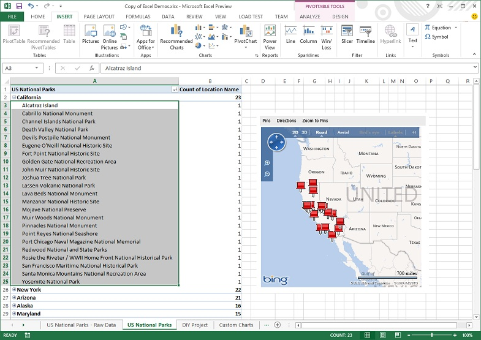
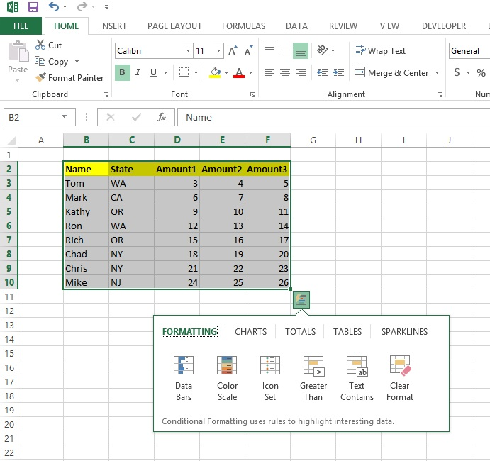

# What's new for Excel 2013 developers
This document provides a top-level view of the enhancements and additions for developers in Microsoft Excel 2013. It also provides links to other articles and references that will enable you to get started programming Excel 2013.

 **Last modified:** March 09, 2015

 _**Applies to:** Excel 2013 | Office 2013 | VBA_

 **Updated:** March 2013

| **In this article**
 [Introduction](a91317a9-8aae-ed5d-9df5-3128fecde1b5.md#xl15WhatsNew_Introduction)
 [Apps for Office in Excel](a91317a9-8aae-ed5d-9df5-3128fecde1b5.md#xl15WhatsNew_AppsForOffice)
 [New Worksheet functions](a91317a9-8aae-ed5d-9df5-3128fecde1b5.md#xl15WhatsNew_WorksheetFunctions)
 [Quick Analysis](a91317a9-8aae-ed5d-9df5-3128fecde1b5.md#xl15WhatsNew_AnalysisLens)
 [Availability of new data sources](a91317a9-8aae-ed5d-9df5-3128fecde1b5.md#xl15WhatsNew_NewDataSources)
 [Using the DataModel OM](a91317a9-8aae-ed5d-9df5-3128fecde1b5.md#xl15WhatsNew_DataModel)
 [Creating PivotCharts and PivotTables independently](a91317a9-8aae-ed5d-9df5-3128fecde1b5.md#xl15WhatsNew_PivotCharts)
 [Single Document Interface](a91317a9-8aae-ed5d-9df5-3128fecde1b5.md#xl15WhatsNew_SDI)
 [Turning animations on and off programmatically](a91317a9-8aae-ed5d-9df5-3128fecde1b5.md#xl15WhatsNewAnimations)
 [Timeline](a91317a9-8aae-ed5d-9df5-3128fecde1b5.md#xl15WhatsNew_Timeline)
 [Protecting sheets takes longer](a91317a9-8aae-ed5d-9df5-3128fecde1b5.md#xl15WhatsNewProtectingsheets)
 [Conclusion](a91317a9-8aae-ed5d-9df5-3128fecde1b5.md#xl15WhatsNew_Conclusion)
 [Additional resources](a91317a9-8aae-ed5d-9df5-3128fecde1b5.md#xl15WhatsNew_AdditionalResources)|

## Introduction

If you develop custom workbook solutions, you can use the following programmability and feature improvements in Microsoft Excel 2013

## Apps for Office in Excel

Microsoft Excel 2013 brings the web to Excel. New apps for Office offer a wealth of interesting, new scenarios and solutions in an easy-to-use environment for dynamic web application development. You now can use popular dynamic languages (such as Python, PHP, Perl, and JavaScript) and web development tools (such as Microsoft Visual Studio 2012) for application development. Web development also enables you to use the strong global developer communities and the availability of various code samples, frameworks and libraries, which broaden application applicability for different scenarios. You can create two kinds of apps for Office in Excel, Content apps and Task pane apps.

 _Content apps for Office_ integrate web-based features as content that can be shown in line with the document. Content apps for Office let you integrate rich, web-based data visualizations; embedded media scenarios, such as integrating a YouTube video player or a picture gallery; as well as other external content capabilities. Figure 1 shows one implementation of a content app in Excel 2013.

**Figure 1. Content app in Excel 2013**

 _Task pane apps for Office_ work side-by-side with an Office document, and let app for Office developers supply contextual information and functionality to enhance the document viewing and authoring experience. For example, a task pane app for Office can look up and retrieve product information from a web service based on the product name or part number the users selects in the document.

**Figure 2. Task pane app in Excel 2013**

## New Worksheet functions

Microsoft Excel 2013 adds about 50 new worksheet functions for compatibility with the Open Document Format (ODF 1.2).

And you can now use web service functions (in the  **Web** functions category) to anonymously access REST Web services. Of special note is the FILTERXML function, which lets you use XPath expressions to filter the XML returned by a WEBSERVICE function call.

## Quick Analysis

Quick Analysis, as shown in Figure 3, is a new contextual UI tool that enables single-click access to data-analysis features, such as formulas, conditional formatting, Sparklines, tables, charts, and PivotTables. You can enable and disable the display of the new Quick Analysis feature in Excel 2013 programmatically by using the  **Show** and **Hide** methods of the **QuickAnalysis** object.

**Figure 3. Quick Analysis tool**

## Availability of new data sources

You can connect to a set of new data sources supported by PowerPivot, including OData feeds, Azure, SharePoint Data Feeds, and additional OLE DB providers. The new  **DataFeedConnection**,  **ModelConnection**,  **TextConnection**, and  **WorksheetDataConnection** objects contain data and functionality needed to connect to new data sources.

**Note**  Documentation for new objects and members in Excel 2013 is not yet complete.

## Using the DataModel OM

A new  **DataModel** object model (an addition to the existing Visual Basic for Applications object model) enables you to load and refresh data sources programmatically. This extension to the PowerPivot model introduced in Excel 2010 lets you integrate additional data sources and the ability to combined data from multiple data sources programmatically. Important new objects in this model include the **Model**,  **ModelChanges**,  **ModelRelationship**, and  **ModelTable** objects.

## Creating PivotCharts and PivotTables independently

You can use the decoupling of PivotCharts from PivotTables in Excel 2013. PivotCharts and PivotTables based on an OLAP or PowerPivot data source can be decoupled such that you can create a PivotChart independently of any PivotTable, and you can navigate through data by using a PivotChart-only experience. This is in contrast to the current paradigm where a PivotChart is created as a companion to a PivotTable. This decoupling is represented in both the Excel 2013 Client and Microsoft Excel Services.

## Single Document Interface

The change to a single-document interface (SDI) in Excel 2013 has implications for programmability. SDI means that each workbook will have its own top-level app window and will have its own corresponding ribbon. All existing  _application-level_ window methods, events, and properties are unaffected by this change. All existing _workbook-level_ window methods, events, and properties now operate on the top-level window for that workbook.

## Turning animations on and off programmatically

You can use the new  **EnableMacroAnimations** property on the **Application** object to toggle the display of animations. Animations are disabled by default during macro execution. To enable animation, add `Application.EnableMacroAnimations = True` at the start of the macro. To allow Excel to show animations during macro execution, make this setting for each macro.

## Timeline

Excel 2013 includes a new Timeline control for filtering modeled data. Timeline offers a visual way to view and change a contiguous range of dates and filter pivot-based objects, such as PivotTables and PivotCharts. Timelines are related to slicers and extend existing slicer-related object model members. In addition, two new Timeline-specific objects are introduced: the  **TimelineState** and **TimelineViewState** objects.

## Protecting sheets takes longer

Protecting sheets takes much longer than in previous Excel versions. It's not noticeable when you're manually protecting a sheet, but if you have code that protects or unprotects sheets repeatedly, it can become a performance issue.

The delay is caused by increased security in Excel 2013 for password-protected files, because it uses a stronger hashing algorithm (SHA-512). In Office 2010, the default hashing algorithm for password protected files is SHA1. This change makes Excel password protected workbooks more secure than they were in previous versions, but can cause a performance issue for some Office Developers. This is by design, so there is no workaround.

## Conclusion

Excel 2013 provides a wealth of new features for developers. Apps for Office provide an exciting opportunity for developers to integrate web-based features into Excel 2013, either as content that can be shown in line with the worksheet, or side-by-side with the worksheet. Other new features that extend the existing Excel 2013 VBA object model include Quick Analysis, the Timeline, a new DataModel OM, the availability of new data sources, and the ability to create PivotCharts and PivotTables independently of each other. In addition, there are new worksheet functions and the ability to use Web service functions to anonymously access REST web services.

## Additional resources

-  [Excel 2013 Developer Reference](5caf65ef-b7f5-4cbe-ab2e-459f027f53a4.md)
    
-  [Build apps for Office](http://msdn.microsoft.com/library/1e123201-6e70-45c1-a48c-d5b955896ddb.aspx)
    
-  [What's New for Office 2013 Developers](http://msdn.microsoft.com/library/d76ae308-555e-4147-8900-956d3eb8ba23.aspx)
    

****   **Contribute to this article**Want to edit or suggest changes to this content? You can edit and submit changes to  [this article](https://github.com/jhershey00/VBA_Excel_Test/OpenXMLCon/articles/a91317a9-8aae-ed5d-9df5-3128fecde1b5.md) using GitHub.

